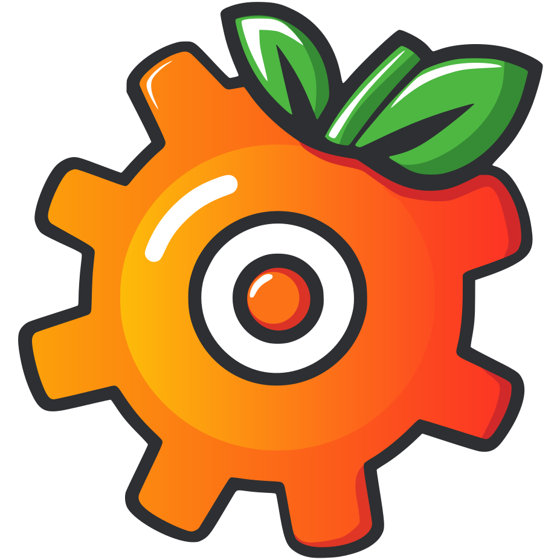

<h1 align="center" style="border-bottom: none">
        
        <br>
        Tomatic
</h1>

<div align="center">

<a href="https://tomatic.app">https://tomatic.app</a>

</div>

<h1>Tomatic</h1>
Openrouter based AI Chat Interface.

Goals:
- Frontend-only (statically hosted)
- All AI models via Openrouter 
- UI Very close to the LLM API interface. No hidden system prompts.
- Space efficient UI, high information density

## Getting Started

1. Setup on your system:

   - [devbox](https://www.jetpack.io/devbox)
   - [direnv](https://direnv.net/)

   ```bash
   # to enter the devbox dev shell loaded by direnv
   direnv allow
   ```

1. Run the development stack

   ```bash
   just dev
   ```

1. Point your browser to <http://localhost:12345>
1. List other useful commands by typing

   ```bash
   just
   ```
